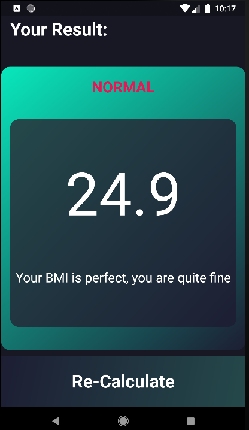

# BMI Calculator

BMI Calculator is a Cross-platform application for Android and iOS for calculating BMI ,
This multi-screen application features a great UI and easy to use Components.
The project is made using Reusable Custom Widget 
Design is inspired from Dribbble.com

# The application
    The front page:

    The Result page:

